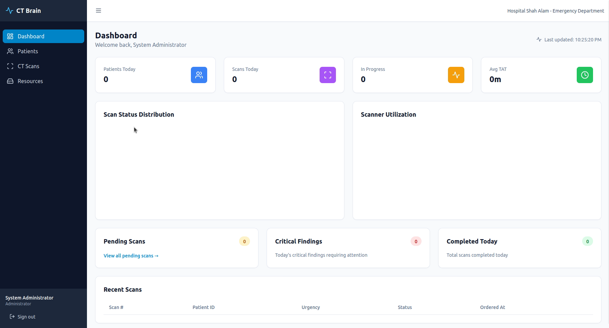
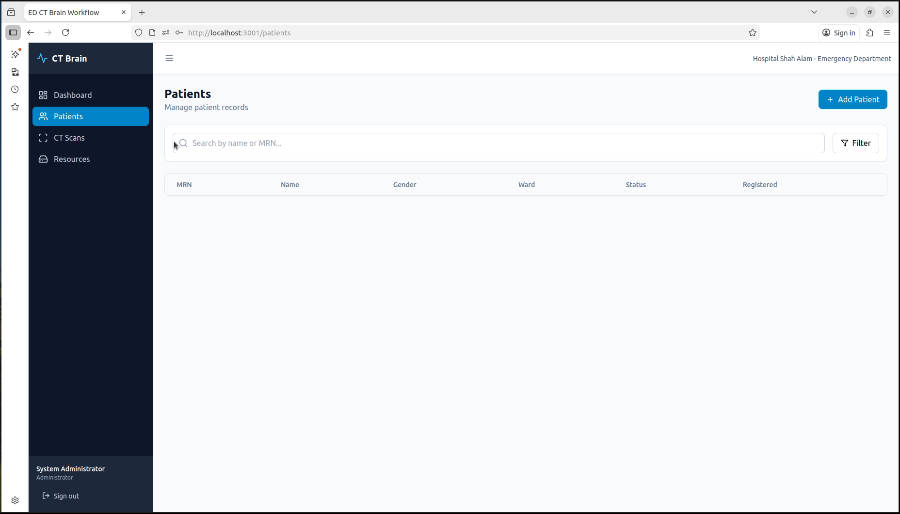
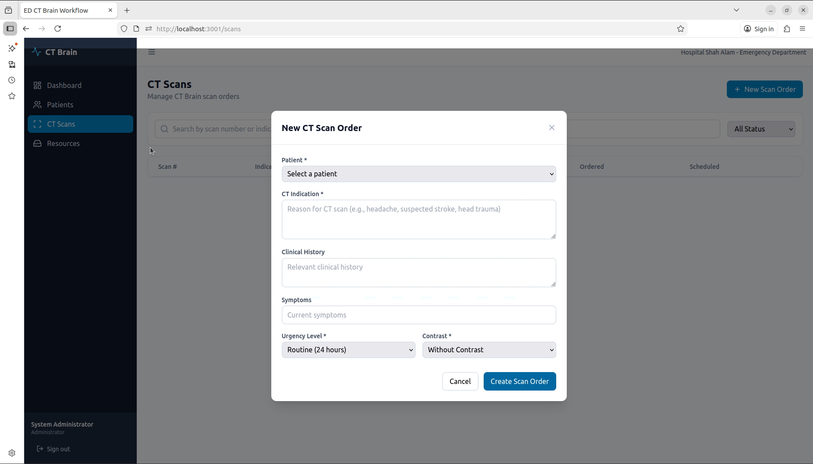
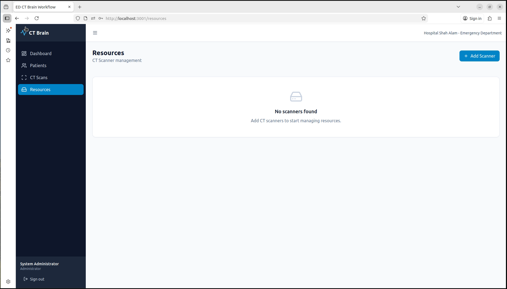

# ED CT Brain Agentic AI Workflow System

A multi-agent AI system for Hospital Shah Alam Emergency Department that automates coordination across ED, Radiology, and Transport teams for CT Brain imaging.

## Features

- **Multi-Agent AI Architecture**: Patient Agent, Clinical Agent, Resource Agent, and Orchestration Agent
- **Real-time Dashboard**: Live tracking of patient journey, scanner status, and queue management
- **Clinical Decision Support**: AI-powered triage, urgency scoring, and CT indication validation
- **Digital Consent**: Tablet-based informed consent with multimedia explanations
- **Smart Queue Management**: Auto-scheduling based on urgency and scanner availability

## Screenshots

### Dashboard


### Patient List


### Scan Management


### Resources


## Tech Stack

| Component | Technology |
|-----------|------------|
| Frontend | React + TypeScript, Tailwind CSS |
| Backend | Python FastAPI |
| Database | PostgreSQL + Redis |
| AI/ML | LangChain, Local LLM |
| Real-time | WebSocket |
| Container | Docker |

## Getting Started

### Prerequisites

- Docker & Docker Compose
- PostgreSQL 15+
- Redis 7+

### Installation

1. Clone the repository:
```bash
git clone https://github.com/your-repo/ed-ct-brain-workflow.git
cd ed-ct-brain-workflow
```

2. Copy environment files:
```bash
cp backend/.env.example backend/.env
cp frontend/.env.example frontend/.env
```

3. Configure environment variables in `backend/.env` and `frontend/.env`

4. Start the application:
```bash
docker compose up -d
```

5. Access the application:
- Frontend: http://localhost:5173
- Backend API: http://localhost:8877
- API Docs: http://localhost:8877/docs

### Default Credentials

```
Email: admin@hospital.shahalam.my
Password: admin123
```

## Project Structure

```
ct_workflow/
├── backend/
│   ├── src/
│   │   ├── agents/          # AI Agent implementations
│   │   ├── api/             # API routes and middleware
│   │   ├── models/          # Database models
│   │   └── utils/           # Utilities
│   ├── .env                 # Environment variables (not committed)
│   └── requirements.txt
├── frontend/
│   ├── src/
│   │   ├── components/      # React components
│   │   ├── pages/           # Page components
│   │   ├── hooks/           # Custom hooks
│   │   └── services/        # API services
│   ├── .env                 # Environment variables (not committed)
│   └── package.json
├── docker-compose.yml
└── README.md
```

## API Documentation

Once running, visit http://localhost:8877/docs for interactive API documentation.

## Environment Variables

### Backend (backend/.env)

| Variable | Description |
|----------|-------------|
| DATABASE_URL | PostgreSQL connection string |
| REDIS_URL | Redis connection string |
| JWT_SECRET | JWT authentication secret |
| LLM_BASE_URL | LLM API endpoint |
| LLM_API_KEY | LLM API key |
| LLM_MODEL | Model name |

### Frontend (frontend/.env)

| Variable | Description |
|----------|-------------|
| REACT_APP_API_URL | Backend API URL |
| REACT_APP_WS_URL | WebSocket URL |

## License

Proprietary - Hospital Shah Alam, Malaysia

---

Built with care for better patient outcomes in Emergency Department CT Brain imaging workflow.